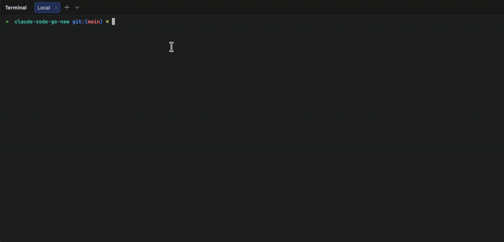

# claude-code-go

## 项目背景

本项目是基于 `@anthropic-ai/claude-code` v2.1.88 npm 发布包及其 Source Map 还原、翻译而来的 Go 语言实现，目标是以单二进制形式提供 AI 编程助手能力。

> 本项目为非官方研究项目，不代表 Anthropic 官方实现，仅供学习与研究使用。

## Demo



## 启动方式

环境要求：Go 1.26 或更高版本。

配置 OpenAI 或兼容服务的地址、API Key 和模型后启动：

```bash
export OPENAI_BASE_URL=""
export OPENAI_API_KEY=""
export OPENAI_MODEL=""

go run ./cmd/cli --provider openai
```

## 功能简介

- 提供交互式终端界面，也支持非交互式调用。
- 支持理解代码库、读写文件、搜索代码及执行终端命令。
- `Ctrl+O` 可循环切换 Normal、Verbose、Summary 三档对话视图。
- 输入 `/diff` 可独立浏览本次会话产生的文件变更。
- 支持 OpenAI 兼容接口与 Anthropic API。
- 内置工具权限检查、Bash 安全解析和执行钩子。
- 支持 MCP、LSP、任务、插件、Vim 模式及对话压缩等能力。
